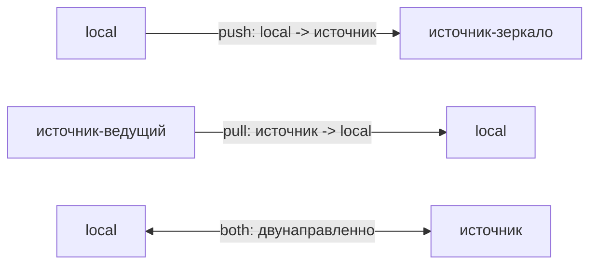
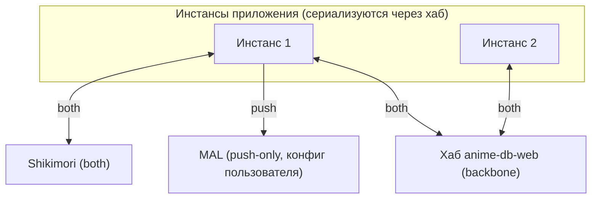
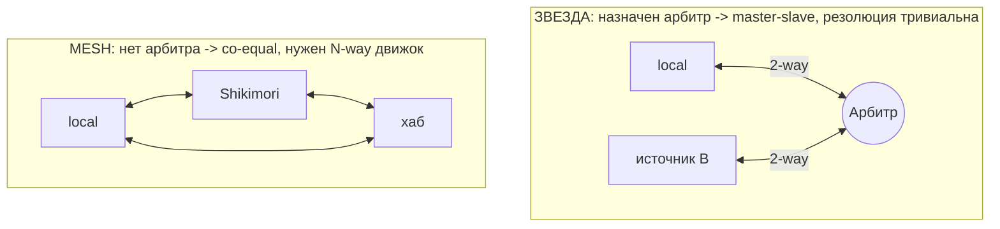
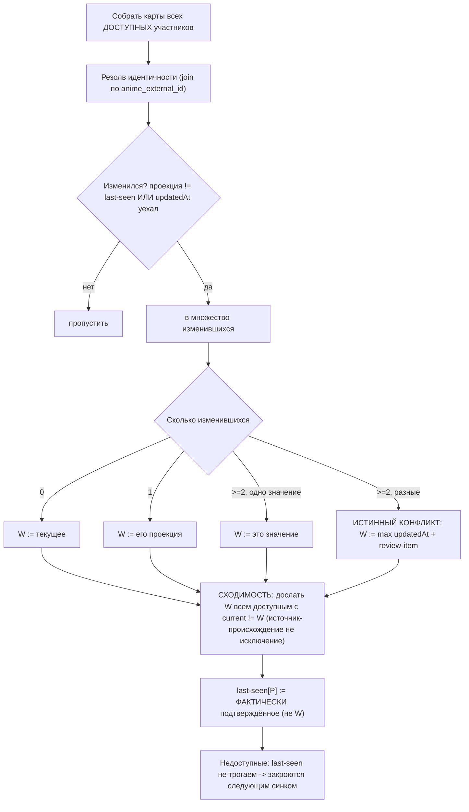
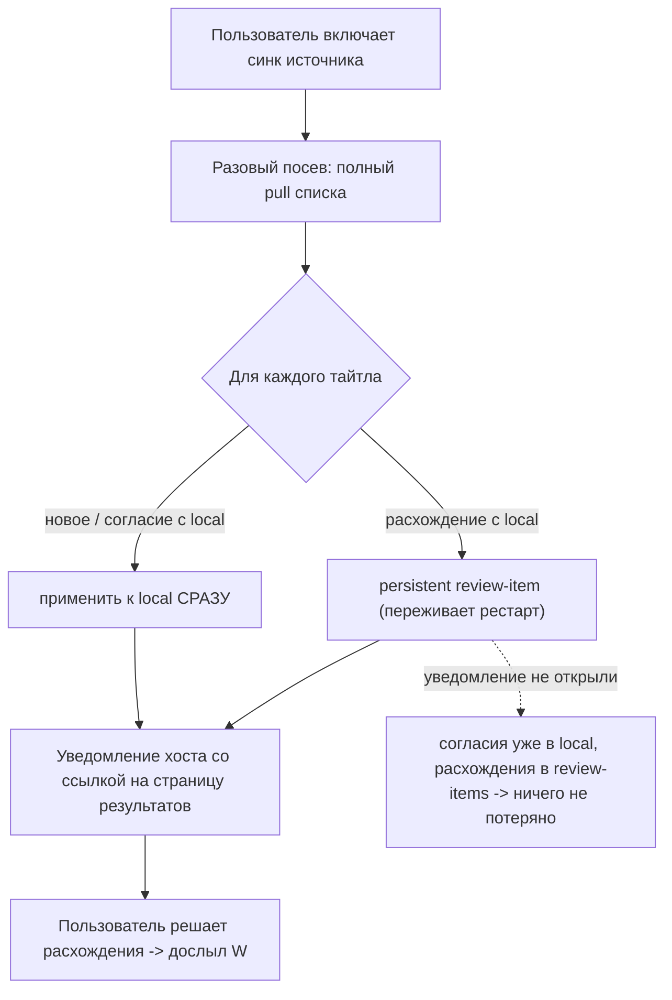

# Синхронизация пользовательских списков

> **Синхронизация — самая опасная и хрупкая часть системы.** Этот документ намеренно выносит все
> подводные камни наружу (диаграммы + реестр ниже), чтобы к ним были готовы и реализация, и ревью.
> Любая правка sync-кода должна сверяться с реестром подводных камней.

Синхронизация ведёт **прогресс просмотра** между приложением и внешними участниками (Shikimori, MAL,
позже — облачный хаб `anime-db-web`). Приложение — один из нескольких равноправных **участников**, а не
единственный источник истины.

Реализация: см. issue #365 (домен/схема), #366 (движок), #367 (UX);
контракт — `anime-db/anime-db-plugin-contracts#53`.

## Единица реконсиляции

Атомарная пара **«прогресс просмотра» `(watchStatus, watchedEpisodes)`**. Домен коуплит их
(`SeriesAnime::setWatchedEpisodes()` выводит статус; `setWatchStatus(Completed)` форсит
`watchedEpisodes := episodesCount`), поэтому синкать порознь **некорректно** — это один факт с одним
таймстемпом `Anime::$watchProgressUpdatedAt`.

## Модель: направление + авторитет per-source

Каждый участник имеет **runtime-конфиг** (не выбор на этапе сборки):

- **направление:** `pull` (источник→local), `push` (local→источник), `both` (двунаправленно);
- **авторитет:** `арбитр` (его значение побеждает при расхождении → master-slave, резолюция тривиальна)
  или `co-equal` (равноправный → таймстемп-арбитраж / страница результатов).

`push`-приёмник конфликтов не создаёт (`local` всегда права); `pull`/`both` от арбитра — тоже. Полный
движок реконсиляции реально работает лишь для **co-equal `both`**, но **строится сразу** (N-way; 2-way —
вырожденный случай N=2). Сменить участнику авторитет `арбитр`↔`co-equal` = смена конфига, без изменения кода.



## Топология

Хаб `anime-db-web` — **backbone**: инстансы приложения синкаются **через хаб**, не напрямую друг с другом
(mesh «каждый-с-каждым» не возникает). Каждый инстанс — двунаправленный клиент хаба с ритмом
**pull-on-startup + push-on-edit**. Внешние источники настраиваются направлением независимо.



> **Важно:** «MAL = push-only» — это **конфиг конкретного пользователя**, а не допущение системы. Другой
> пользователь может сделать MAL `both`. Движок общий (N-way) и не затачивается под чью-либо топологию.

### Ось арбитража — звезда против mesh



> **Подводный камень «мост»:** арбитр (хаб) убирает **только** комбинаторику `инстанс↔инстанс`. На
> инстансе-мосте остаются три независимых `both`-участника (`local`, `hub`, `Shikimori`) → настоящий
> 3-way конфликт на самом инстансе. Поэтому движок N-way нужен всё равно; арбитр его не отменяет.

## Алгоритм реконсиляции (на тайтл)

**Проекция** = `(watchStatus, watchedEpisodes)`. **Карта** = текущая проекция участника + его `updatedAt`
(для `local` — `watchProgressUpdatedAt`). **Снимок** `anime_sync_state` — last-seen проекция + last-seen
`updatedAt` на `(anime, participant)`, база слияния.

1. Собрать карты со всех **доступных** участников (недоступный источник не участвует, его `last-seen` **не
   трогаем**).
2. **Множество изменившихся** = проекция ≠ last-seen **ИЛИ** `updatedAt` уехал вперёд.
3. **Победитель `W`:** 0 → без изменений; 1 → его проекция; ≥2 одинаковых → это значение; ≥2 разных →
   **истинный конфликт** → `W := max updatedAt` (best-effort) + persistent review-item «Поправить».
4. **Сходимость:** доступному `P` с `P.current ≠ W` дослать `W` — **включая источник-происхождение**,
   если и его снимок разошёлся с `W` (например, после дропа push-on-edit по TTL — иначе расхождение
   никогда не самозаживёт). Источник-происхождение естественным образом не получает лишний эхо-пуш:
   когда именно его свежее чтение стало (единственной или единогласной) причиной выбора `W`, `W`
   буквально совпадает с его проекцией, и он отфильтровывается тем же условием `P.current ≠ W`, что и
   любой другой уже согласный участник. `last-seen[P] := ФАКТИЧЕСКИ подтверждённое состояние` (не
   абстрактный W).
5. Недоступные закрываются следующим синком.



## Ритм записи: push-on-edit

Быстрый оптимистичный путь: ручная правка → очередь Messenger (`PushSyncMessage` + `retry_strategy`),
**TTL ≤ 5 мин** по времени диспатча (привязан к конфигу транспорта). Немедленный push — слепая
оптимистичная запись; уверенность падает с временем → после 5 мин отдаём стандартному дневному синку.

- истечение TTL — **без потерь**: правка уже в `local`, `local ≠ last-seen` (dirty) → следующий синк подхватит;
- хендлер пушит **текущее** `local` (не заснапшоченное в событии) → быстрые правки самокорректируются;
- после успешного push `last-seen[source] := подтверждённое` из `push():SyncItem` — иначе фантомный «changed».

```mermaid
sequenceDiagram
    actor U as Пользователь
    participant DOM as Домен Anime
    participant Q as Очередь Messenger (TTL <= 5 мин)
    participant SRC as Источник
    participant SNAP as Снимок anime_sync_state
    U->>DOM: ручная правка (статус ИЛИ эпизоды)
    Note over DOM: доменный триггер (НЕ Doctrine preUpdate); watchProgressUpdatedAt := now()
    DOM->>Q: dispatch PushSyncMessage(animeId, dispatchedAt)
    alt онлайн и (now - dispatchedAt) <= 5 мин
        Q->>SRC: push(SyncItem) - читает ТЕКУЩЕЕ local
        SRC-->>Q: SyncItem (подтверждённое источником)
        Q->>SNAP: last-seen[source] := подтверждённое
    else оффлайн / TTL истёк
        Note over Q: событие отброшено (правка НЕ потеряна - она в local)
        Note over SNAP: last-seen не тронут -> local != last-seen (dirty)
        Note over SRC: добьёт дневной синк по dirty / last-pushed
    end
```

## Различие ручная / синк-правка (несущее)

- **Ручная правка (UI):** `watchProgressUpdatedAt := now()` + broadcast во **все** приёмники. Доменный триггер.
- **Синк-правка (`applyWatchProgress`):** `watchProgressUpdatedAt := время источника`; листенер **подавлен**
  (репозиционированный `PullPushSuppressor`); распространение — всем участникам, чьё текущее значение
  расходится с `W` (источник-происхождение — не исключение, если разошёлся и он). Эхо pull→push (#352)
  снимается автоматически тем же условием «расходится с `W`» **без** удушения forward-пропагации.

## connect-seed (включение синка источника)

Синк — opt-in. При включении: разовый посев (полный pull) → согласия/новое применяются к `local` **сразу**,
расхождения → **persistent review-items**; страница настроек плагина рендерится как обычно (с уведомлением
хоста о запущенном посеве), а на страницу результатов — только ссылка из этого уведомления (issue #865: без
завершённого OAuth `pull()` сам не стартует, и редирект на каждый визит до авторизации не давал добраться до
кнопки авторизации в разметке плагина).



**Посев и push не пересекаются.** Посев идёт в `plugins-consumer` (транспорт `sync`), push — в
`messenger-consumer` (`async`): два процесса с разными EntityManager. Посев держит `JobLockService` с ключом
`sync:<pluginId>` (`SyncSeedMessage::jobKey()`, heartbeat на каждый элемент pull); пока лок держится,
`PushSyncMessageHandler` пропускает push этого плагина (info-лог). Правка не теряется: она уже в local, а
реконсиляция pull видит её как «грязного» участника — тот же механизм, что у отбрасывания по TTL. Без лока
push и pull могли одновременно вставить `AnimeSyncState(anime, plugin)` (PK-коллизия закрывает EntityManager pull
и обрезает остаток посева) либо push перезаписал бы снапшот, с которым pull уже работает. Проверка лока в push
не атомарна с самим push — окно длиной в один вызов `push()` против лока на весь посев, принято.

## Реестр подводных камней

| #  | Подводный камень                                                          | Митигация                                                                                                           |
|----|---------------------------------------------------------------------------|---------------------------------------------------------------------------------------------------------------------|
| 1  | Окно неатомарности: правку на источнике между pull и записью W не поймать | принято неустранимым (без source-side CAS); редко при daily/1000; не «отравляем» снимок → следующий синк реконсилит |
| 2  | Эхо pull→push (#352)                                                      | различие ручная/синк + пропагация всем, чьё current расходится с W (источник не исключение при реальном дрейфе)     |
| 3  | Грубость `updatedAt` (record-level, бампается на score)                   | детекция по **проекции**, не по времени; время — лишь тай-брейк                                                     |
| 4  | Истинный конфликт арбитрируется грубым временем                           | best-effort + review-item «Поправить» (пиннит значение)                                                             |
| 5  | push-on-edit не видит `watchedEpisodes`                                   | триггер push в домене, не в Doctrine preUpdate                                                                      |
| 6  | push-on-edit мимо снимка → фантомный «changed»                            | обновлять `last-seen[source]` из `push():SyncItem`                                                                  |
| 7  | W непредставим локально (коэрция домена статус↔эпизоды)                   | `last-seen[local] := фактически сохранённое` (read-back), не W                                                      |
| 8  | `Completed` без дат релиза → исключение роняет прогон                     | ловить `InvalidWatchStatusException`/`InvalidEpisodeCountException`, не применять + флаг                            |
| 9  | connect-seed limbo (перезапись local до решений, потеря при закрытии)     | согласия сразу + **persistent** review-items                                                                        |
| 10 | TTL истёк оффлайн                                                         | dirty → дневной синк; `last-pushed` маркер у push-only                                                              |
| 11 | Мост инстанс↔хаб + инстанс↔Shikimori возвращает N-way                     | движок N-way строится сразу; арбитр не отменяет                                                                     |
| 12 | cross-vendor дубли (тайтл под одним вендором → вторая строка)             | ручной `SyncReviewService` (`CrossVendorDuplicateDetector` только флагует), вне merge                               |
| 13 | recovery-EM после create-conflict теряет снимок                           | recovery-EM обязан вести `anime_sync_state`                                                                         |
| 14 | `push():SyncItem` возвращает `now()`-догадку, если API не даёт время      | предпочитать реальный `updatedAt`; расхождение самозаживает как no-op                                               |
| 15 | clock skew между источниками                                              | доверяем source `updatedAt` при NTP — принято                                                                       |
| 16 | Частичный ответ (429/обрыв пагинации) ≠ «источник недоступен»             | не трактовать частичный как «источник согласен»                                                                     |
| 17 | origin безусловно исключался из сходимости -> TTL-дрейф не самозаживал    | убрать спецкейс origin; та же equals()-фильтрация против W чинит и эхо, и дрейф                                     |
| 18 | первый контакт затирает локаль (нет строки снимка ≠ реальной истории)     | синтез «локаль согласна» только при watchProgressUpdatedAt===null (бэкфилл date_update покрывает старые записи)     |
| 19 | null-эпизоды формируют ложный конфликт (нет данных ≠ иное значение)       | equals() трактует null как «не сообщено», не конфликтует ни с чем; слияние берёт непустое значение эпизодов         |
